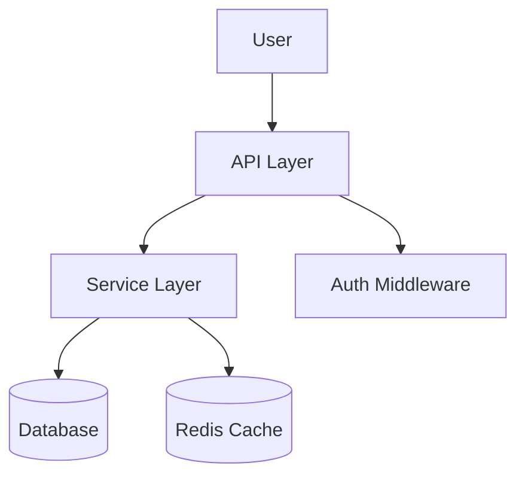
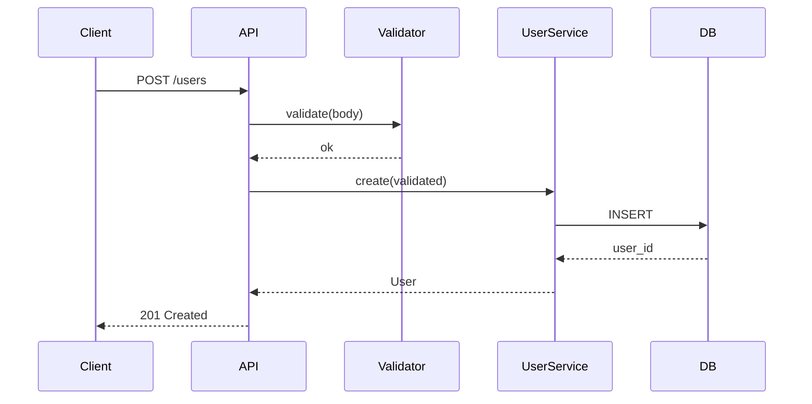
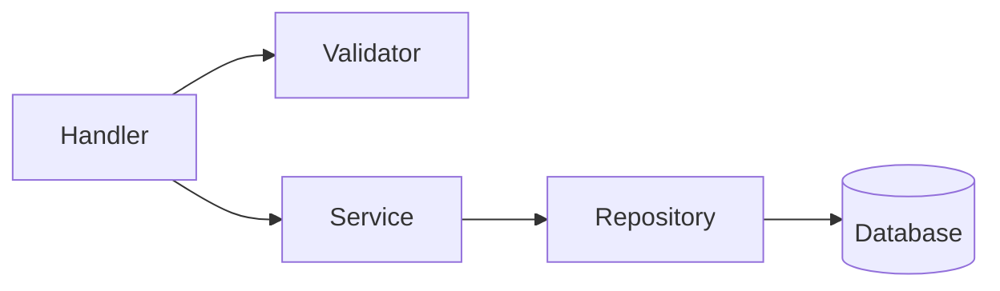

# Hierarchy Patterns: Layered Documentation for LLM Navigation

Loaded by agentify during Phase 3 (Design). Contains the layering
principles, token budgets, Mermaid guidelines, and placement strategy.

---

## The Core Problem

An LLM agent opening a codebase has a fixed context window. Two failure modes:

1. **Context bloat**: stuffing everything into CLAUDE.md means every task pays
   for thousands of tokens of irrelevant docs — and adherence drops
2. **Lost in the Middle**: Liu et al. (2023) showed models miss information
   buried deep in long contexts — critical facts must appear at the start or
   end of the context, with indices pointing deeper

The solution is **progressive disclosure**: top-level context is just a namespace
and pointer map, the next level is brief orientation, deeper levels are full
details. Each level loads only when the agent needs it.

---

## The Multi-Level Hierarchy

```
L-1: ~/.claude/projects/<project>/memory/MEMORY.md  (auto memory)
     → Claude's own notes from prior sessions; first 200 lines loaded at startup
     → Never overwritten by this skill — detected and accounted for

L0: CLAUDE.md              (≤200 lines)  ALWAYS loaded
    ↓ points to
L1: docs/OVERVIEW.md       (≤400 lines)  loaded on demand for architecture
    ↓ points to
L2: docs/{component}.md    (≤300 lines)  loaded on demand per component
    ↓ alongside
L3: .claude/rules/*.md     (≤100 lines)  auto-loaded when editing matched files
    ↓ alongside
L3: ~/.claude/rules/*.md   (≤100 lines)  user-level rules, loaded for all projects
    ↓ alongside
L3: Inline docs             (no limit)    always present in the code itself
    ↓ alongside
L4: CLAUDE.local.md        (≤200 lines)  personal project preferences, gitignored

```

---

## What Goes at Each Level

### L-1: `~/.claude/projects/<project>/memory/MEMORY.md` — auto memory

This is Claude-managed — the skill never writes to it. But it's loaded at
startup (first 200 lines / 25KB) alongside CLAUDE.md, so the generated docs
must avoid duplicating information Claude already has in auto memory.

**When writing CLAUDE.md, check for auto memory first:**
- If auto memory already documents build commands → reference it, don't duplicate
- If auto memory has debugging patterns → don't repeat them in CLAUDE.md
- The goal is complementary content, not repetition

### L0: CLAUDE.md — namespace + pointer map

**DO include:**
- Project name (1 line)
- 2-3 sentence purpose (what it is, what it does, what it does NOT do)
- 3-5 key commands: build, test, run, lint — the ones an agent runs most often
- Any absolute non-obvious constraints ("never commit directly to main", "always run migrations before tests")
- Navigation table: one row per major doc, pointing deeper

**DO NOT include:**
- Architecture details (→ OVERVIEW.md)
- Per-component patterns (→ rules/ or component docs)
- Long lists of anything (→ lower level)
- More than 5 commands (the rest go in OVERVIEW)
- Mermaid diagrams (→ OVERVIEW.md)
- Content already present in auto memory (MEMORY.md)

**@import pattern for modularity:** For large projects, CLAUDE.md can use
`@path/to/file` syntax to import sub-files. This keeps the main file lean while
allowing team-specific sections:
```markdown
@docs/build-commands.md

# Project Conventions
...
```
Imported files are loaded at startup (they count toward the 200-line budget in
aggregate). Use this pattern judiciously — it helps organization but does not
reduce total context consumption.

**AGENTS.md compatibility:** If the repo has AGENTS.md, CLAUDE.md should import
it with `@AGENTS.md` (or symlink to it) to avoid duplicating shared instructions.
Add Claude-specific instructions below the import:
```markdown
@AGENTS.md

## Claude Code
...
```

### L1: docs/OVERVIEW.md — orientation

**DO include:**
- Architecture diagram (Mermaid `graph TD`, ≤15 nodes)
- Component responsibilities table (name, responsibility, 2-3 key files)
- Primary data/request flow (Mermaid `sequenceDiagram`)
- External dependencies (services, databases, APIs)
- "Read more" links to each L2 component doc

**DO NOT include:**
- Per-component internal patterns (→ component docs)
- Code snippets longer than 10 lines (→ component docs)
- Exhaustive file listings (→ component docs)

### L2: docs/{component}.md — deep dive

**DO include:**
- 3-5 sentence purpose and scope
- Key files table with one-line descriptions
- The 3-5 most important patterns in this component
- Gotchas from git history (repeated fixes = real pain points)
- Mermaid internal diagram if the component has >3 sub-files (`graph LR`)
- "See also" cross-links

**DO NOT include:**
- Repo-wide information (→ OVERVIEW or CLAUDE.md)
- Copies of another component's doc (→ cross-reference instead)

### L3: .claude/rules/ — path-scoped domain conventions

**DO include:**
- Coding style specific to a domain ("API handlers must validate input before calling services")
- Error handling patterns for a module
- Naming conventions for a specific directory

**DO NOT include:**
- Architecture (→ OVERVIEW)
- Onboarding info (→ CLAUDE.md + OVERVIEW)
- Repo-wide conventions (→ CLAUDE.md)

### L3 also: .claude/context-map.md — the navigator

The context map is a **pure index**. Its only job: "I need to find X —
which file should I read?" Every entry is `topic → file`. No explanations
here; they belong in the target files.

---

## "Lost in the Middle" Mitigation

Place in CLAUDE.md:
- **Lines 1–30**: Most critical info (name, purpose, 3-5 commands) — primacy position
- **Lines 31–180**: Supporting info (constraints, conventions)
- **Lines 181–200**: Pointer/navigation table — recency position, easy to scan to

**Why last for the pointer map?** Agents frequently scan to the end to find
"where do I go next." Recency effect makes this the optimal position for
navigation. Critical operational info (commands) must be early because of
primacy effect.

---

## Token Budget Table

These are hard limits, not suggestions. Note that total startup context is
~8,000 tokens before the user types anything (Claude Code 2026).

| File | Line limit | Rationale |
|------|-----------|-----------|
| CLAUDE.md | 200 | Always loaded; beyond 200 the bottom half is often ignored |
| CLAUDE.local.md | 200 | Personal file, same budget as CLAUDE.md |
| Auto memory (MEMORY.md) | 200 lines / 25KB loaded | Claude-managed; this skill detects but never modifies |
| .claude/rules/*.md | 100 | Small-scope domain; if it needs more, split the domain |
| ~/.claude/rules/*.md | 100 | User-level rules; same budget as project rules |
| docs/OVERVIEW.md | 400 | On-demand; long enough for full architecture narrative |
| docs/{component}.md | 300 | Deep dive; more means it should be split into sub-components |
| .claude/context-map.md | 150 | Pure index; if this is long, the hierarchy is too flat |

**Trim strategy — always move overflow DOWN, never up:**
- CLAUDE.md overflow → move architecture to OVERVIEW.md
- OVERVIEW.md overflow → move component details to component docs
- Component doc overflow → extract a sub-component doc (e.g., `auth-tokens.md`)
- Rules file overflow → split domain (e.g., `api-validation.md`, `api-errors.md`)

---

## Mermaid Diagram Guidelines

These render inline in Claude Code without a browser or HTML files.

**Architecture diagrams (OVERVIEW.md):**


**Data flow (OVERVIEW.md):**


**Component internals (component docs, only if >3 sub-files):**


**Rules:**
- ≤15 nodes for architecture diagrams (more → split into sub-diagrams)
- ≤8 participants in sequence diagrams
- `graph TD` (top-down) for hierarchy and system architecture
- `graph LR` (left-right) for component internals and data flow
- Short, meaningful labels — no full sentences in nodes

---

## docs/NAVIGATION.md Template

```markdown
# How to Navigate and Maintain These Docs

## The hierarchy
- **CLAUDE.md** — always loaded; ≤200 lines; pointers only
- **CLAUDE.local.md** — personal, gitignored; add your preferences here
- **docs/OVERVIEW.md** — architecture; loaded on demand
- **docs/{component}.md** — deep dives; loaded on demand
- **.claude/rules/** — domain conventions; auto-loaded when editing matched files
- **~/.claude/rules/** — user-level rules; apply to all your projects
- **.claude/context-map.md** — lookup index: "to find X, read Y"
- **Auto memory (MEMORY.md)** — Claude-managed; not generated by this tool

## Subagent note
Subagents load their own copy of CLAUDE.md and receive their own context.
Keep component docs self-contained so they work in a subagent's fresh context.
Path-scoped rules load for subagents too when they edit matching files.

## When to update
- New component added → create `docs/{component}.md`, add pointer in OVERVIEW
- API changes → update `.claude/rules/api.md` + relevant component doc
- Repo-wide convention changes → update CLAUDE.md
- Large drift from reality → run: `/agentify update`

## Token budgets
| File | Limit |
|------|-------|
| CLAUDE.md | ≤200 lines |
| CLAUDE.local.md | ≤200 lines |
| .claude/rules/*.md | ≤100 lines each |
| ~/.claude/rules/*.md | ≤100 lines each |
| docs/OVERVIEW.md | ≤400 lines |
| docs/{component}.md | ≤300 lines each |
| .claude/context-map.md | ≤150 lines |

Overflow always moves **down** the hierarchy, never up.
```
