# Diagram Guide: When to Use What

Use the right visualization for the concept you're explaining. A well-chosen diagram makes abstract ideas concrete; a poorly-chosen one adds confusion.

## Quick Reference Table

| Concept | Best Diagram | Also Consider |
|---------|--------------|---------------|
| **"What calls what"** | Call Graph | Dependency Graph |
| **"What depends on what"** | Dependency Graph | Module Map |
| **"How a request flows"** | Sequence Diagram | Data Flow |
| **"How objects relate"** | Class Diagram | Entity Relationship |
| **"System components"** | Architecture Diagram | C4 Context |
| **"Data transformations"** | Data Flow Diagram | Flowchart |
| **"Step-by-step process"** | Flowchart | Sequence Diagram |
| **"State changes"** | State Diagram | Sequence Diagram |
| **"Conditional logic"** | Decision Tree | Flowchart |
| **"Layered structure"** | Layer Diagram | Architecture Diagram |
| **"Timeline of events"** | Sequence Diagram | Timeline |

## Detailed Guide

### Call Graph
**Use when:** You want to understand control flow — which function calls which, and ultimately what happens when you invoke something.

**What it shows:**
- Function-to-function relationships
- Entry points
- Deep call chains
- Potentially cyclic code

**Example trigger:** "What happens when I call `process_user()`?"

**Mermaid:**
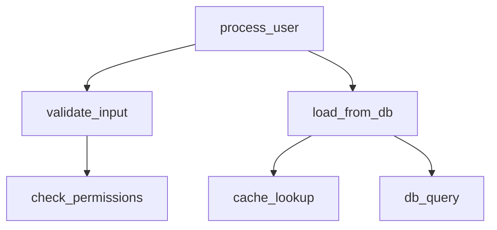

### Dependency Graph
**Use when:** You want to understand coupling — what modules rely on what, where changes might propagate.

**What it shows:**
- Module-level dependencies
- Cyclic dependencies (problematic)
- High-dependency "hub" modules
- Direction of coupling

**Example trigger:** "If I change the database adapter, what breaks?"

**Mermaid:**
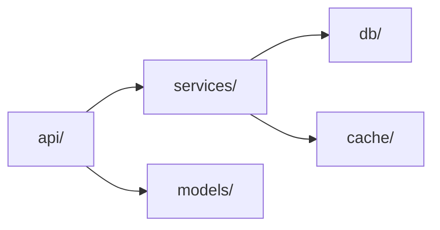

### Architecture Diagram
**Use when:** You want the 30,000-foot view — what are the major components and how do they interact.

**What it shows:**
- Top-level components
- External integrations
- Data流向
- Deployment topology

**Example trigger:** "Give me an overview of how this system is structured"

**Excalidraw style:** Use boxes for components, arrows for connections, icons for tech stack (database, API, etc.)

### Sequence Diagram
**Use when:** You want to understand temporal interactions — A talks to B, then B talks to C, then A gets a response.

**What it shows:**
- Object/class interactions over time
- Message passing
- Return values
- Timing/ordering constraints

**Example trigger:** "What happens when a user logs in?"

**Mermaid:**
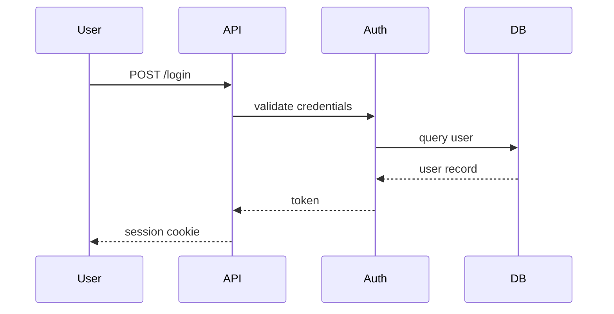

### Class Diagram
**Use when:** You want to understand object-oriented structure — inheritance, composition, interfaces.

**What it shows:**
- Classes and their properties
- Inheritance hierarchies
- Method signatures
- Relationships (has-a, uses-a)

**Example trigger:** "What are the main classes and how do they relate?"

### Data Flow Diagram
**Use when:** You want to understand how data transforms — input → process → output.

**What it shows:**
- Data inputs and outputs
- Processing steps
- Data stores
- External entities

**Example trigger:** "How does a raw API request become a stored database record?"

### Flowchart
**Use when:** You want to understand conditional logic — what branches happen based on input.

**What it shows:**
- Decision points
- Process steps
- Alternative paths
- Loop structures

**Example trigger:** "Walk me through the decision logic for approving a transaction"

## Choosing Based on Audience

| Audience | Recommended |
|----------|-------------|
| **New to codebase** | Architecture Diagram → then Call Graph |
| **Debugging a specific flow** | Sequence Diagram |
| **Understanding dependencies** | Dependency Graph |
| **OOP design discussion** | Class Diagram |
| **Big picture overview** | Architecture Diagram |
| **Data transformation logic** | Data Flow Diagram |

## Combining Diagrams

Complex concepts often need multiple diagrams:

1. **Architecture** shows components at rest
2. **Sequence** shows what happens when they interact
3. **Call Graph** shows internal function relationships

Example: Understanding a web request
- Architecture: "We have a load balancer, web servers, and a database"
- Sequence: "The request comes in, hits the auth middleware, then the handler"
- Call Graph: "The handler calls validate, which calls check_db, which calls..."

## Common Mistakes

- **Too much detail** — A call graph with 100 nodes is unreadable. Focus on relevant subset.
- **Wrong abstraction level** — Class diagram for system architecture is too granular; architecture diagram for single function is too high-level.
- **No legend** — Always explain what shapes/colors mean.
- **Static vs Dynamic confusion** — Call graphs can be static (potential calls) or dynamic (actual calls at runtime). Know which you're showing.

## Rendering Tools

| Tool | Good For | Limitations |
|------|----------|-------------|
| **Mermaid** | Flowcharts, sequences, class diagrams — renders inline in Claude Code | Complex layouts can be messy |
| **Graphviz DOT** | Large dependency graphs | Less control over aesthetics |
| **PlantUML** | UML diagrams | Syntax-heavy |
| **ASCII** | Quick, no rendering needed | Poor for complex diagrams |

---

## Project-Type Visual Templates

Load this section when `project_type` is known. Use these as skeletons — fill in actual module names from analyze.py output. Each set covers the three Phase 1 diagrams in order: topology → dependency map → data flow.

### web_app

**Diagram 1 — System topology:**
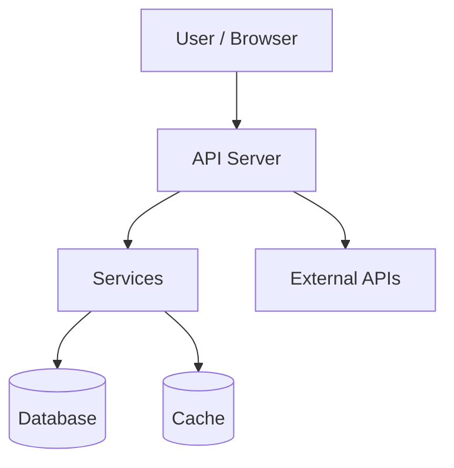

**Diagram 2 — Module dependency map** (fill in from code-graph.py output):
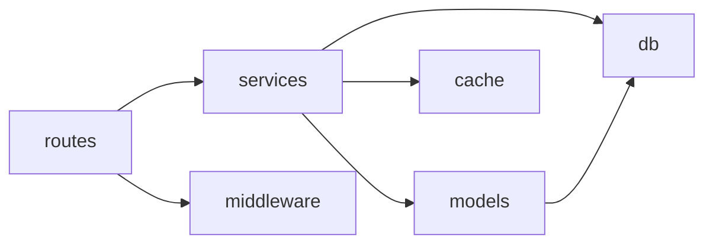

**Diagram 3 — Request lifecycle (include if a dominant HTTP path exists):**
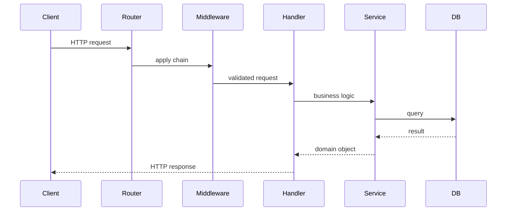

---

### cli_tool

**Diagram 1 — System topology:**
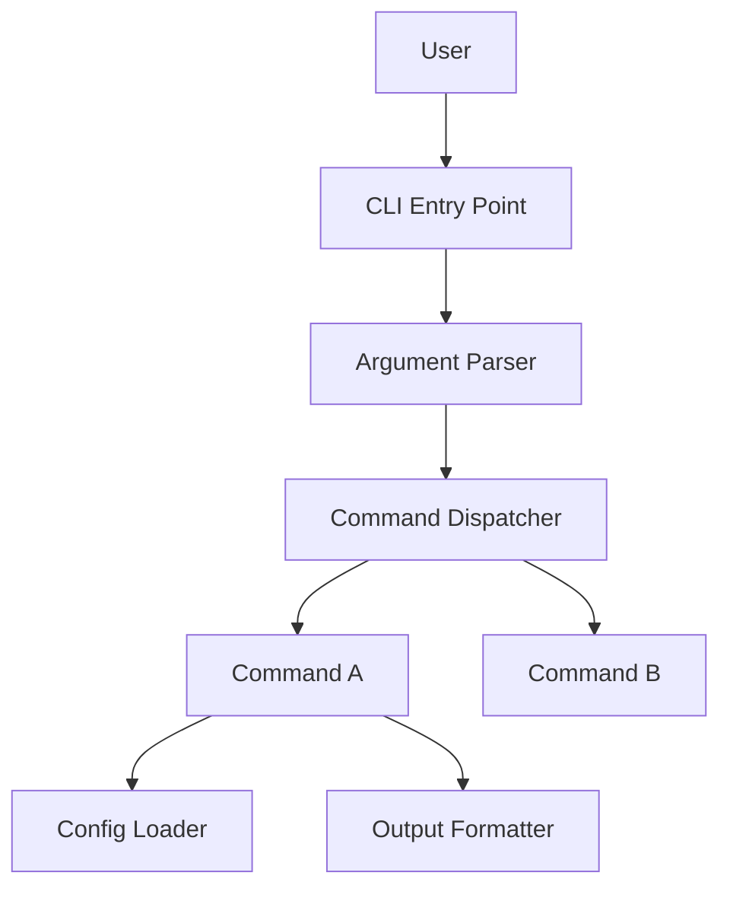

**Diagram 2 — Module dependency map** (fill in from code-graph.py output):
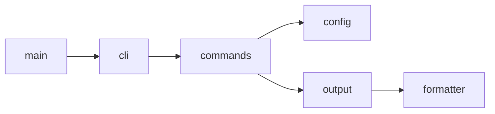

**Diagram 3 — Command execution flow (include if commands have non-trivial logic):**
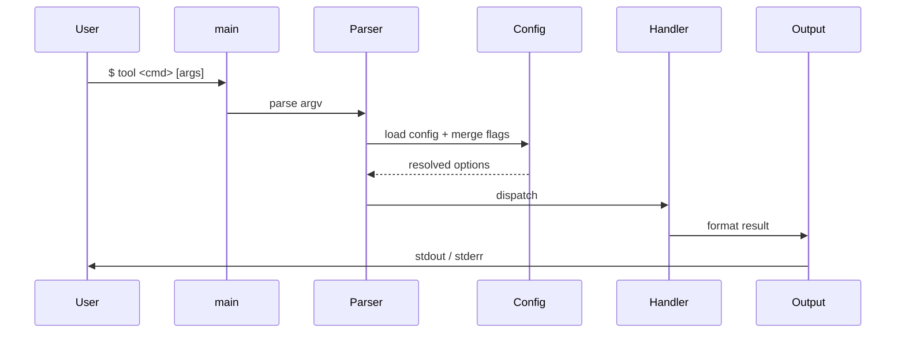

---

### library

**Diagram 1 — System topology:**
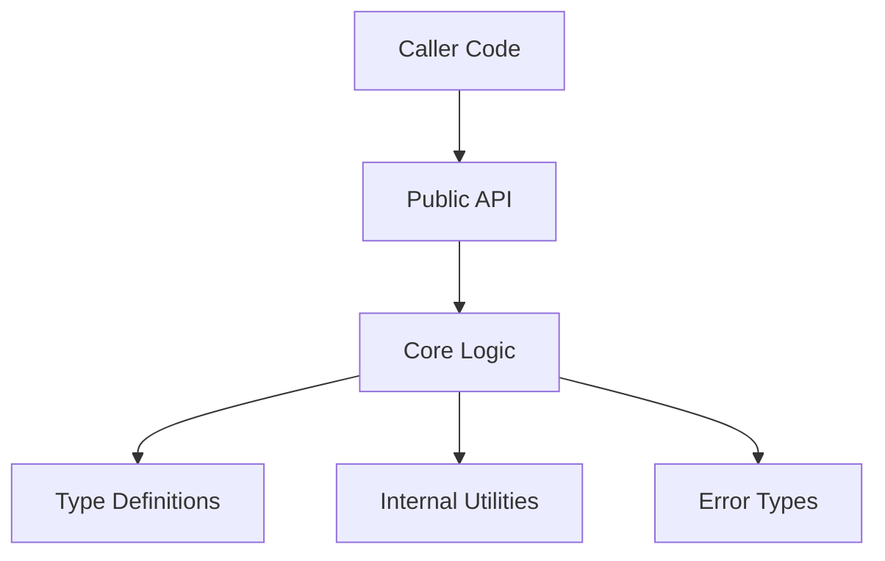

**Diagram 2 — Module dependency map** (fill in from code-graph.py output):
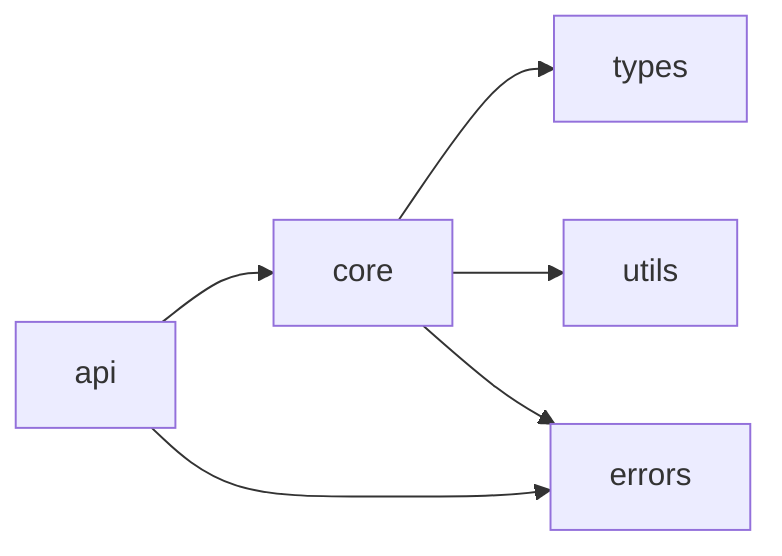

**Diagram 3 — Usage flow (include for libraries with stateful or multi-step APIs):**
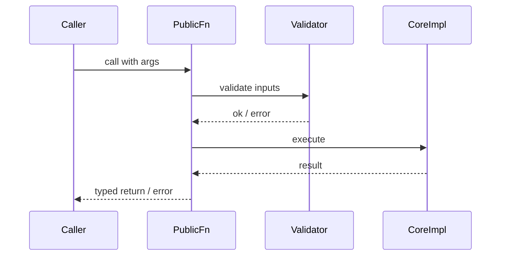

---

### data_pipeline

**Diagram 1 — System topology:**
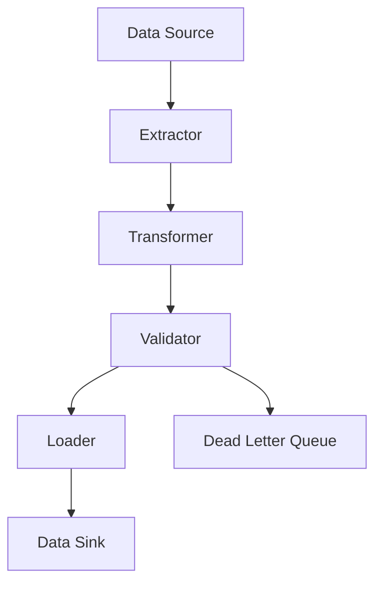

**Diagram 2 — Module dependency map** (fill in from code-graph.py output):
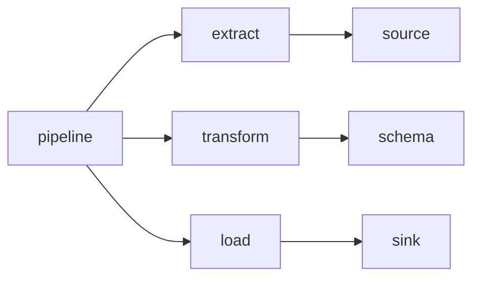

**Diagram 3 — Stage execution flow (include for pipelines with explicit orchestration):**
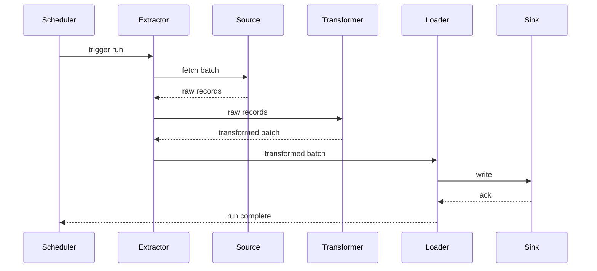